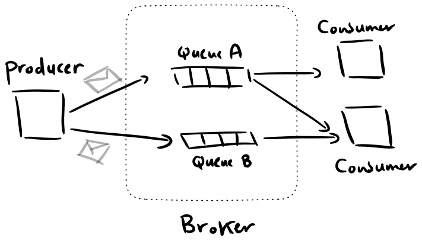
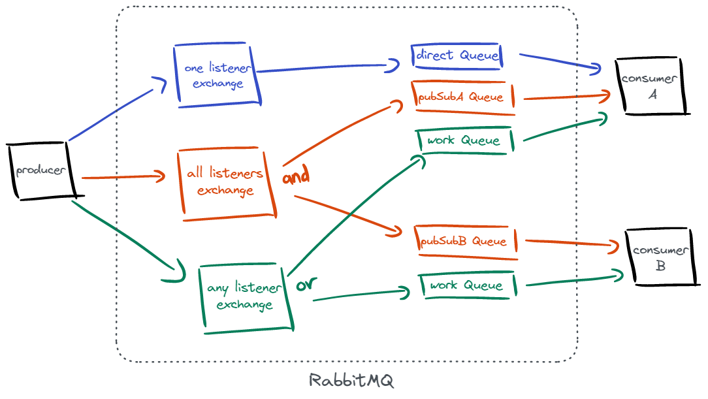

# **Messaging Queues Demo Using RabbitMQ & Nodejs**

A messaging queue is a component that enables asynchronous communication between components in a system.

Their use cases include

- Decoupling system components
- Offloading intensive workloads
- Notifying other parts of a system about a change
- Performing time insensitive actions while not blocking a system (sending email,notifications, etc...)

and many others.

A queue provides flexibility in a system, because the consumers don't need to know who the producer is, and vice versa.

---

## **Components of a MQ**

Message queues generally consists of the following parts:

- **Event Producers**, processes that generate events
- **Event Consumers**, processes that handle events
- **Message Queues**, sometimes called topics, are groupings of events that are in the same cateogry. Consumers opt-in to the specific queue/topic they want to consume.
- **Message Brokers**, co-ordinates message delivery from queues to consumers & handles retries, delivery acknowledgments, etc...

In this repo, we use [RabbitMQ](https://www.rabbitmq.com/) as the broker, other options are available like [Apache Kafka](https://kafka.apache.org/), [Celery](https://docs.celeryq.dev/en/stable/), [Amazon SQS](https://aws.amazon.com/sqs/) and others.



---

## **Demo Scenario**

This repo contains 4 services

- Broker
- Event producer
- 2 Consumers, A & B

The message queues will have the following setup

- **Direct Queue**, this queue sends messages to consumer A only.
- **Work Queue**, messages delivered here will be sent out to one of the consumers A or B in a Round Robin fashion.
- **Publish / Subscribe Queue**, messages delivered here will reach all listeners consuming the queue, both consumers A & B.

In RabbitMQ, messages are not sent directly to queues. Instead they are published to exchanges, which then route them to the appropriate queues.

When a queue is created, it is bound to an exchange to be eligible to recieve messages from that exchange


[Read more about exchanges and their types.](https://www.rabbitmq.com/tutorials/amqp-concepts.html#amqp-model)

Taking the exchanges into consideration, the structure of the queues and exchanges in the demo will be as per the figure



Note that exchange & queue names are arbitrary and not mandated by RabbitMQ.
The figure is meant to show the exchanges, their bound queues and which consumers are are listening to what queues.

---

## **Usage**

To get started, clone the repo and run the following docker command from the repo's directory

```
docker compose up --build
```

If you don't have docker installed, run the producer and consumers NodeJS servers from their respective folders, and follow the instructions [here](https://www.rabbitmq.com/download.html) to get RabbitMQ running for your system.

---

### **Running services**

After the compose command finishes, the following services should be running :

- `localhost:3000` , Event producer
- `localhost:5672` , RabbitMQ
- `localhost:15672` , RabbitMQ dashboard (username: guest, password: guest). The dahsboard shows various statistics & information about the active queues, exchanges, consumers, etc...

Your terminal should have an output similar to the following.

```
consumer-b      | Consumer B Listening...
rabbit-broker   | 2023-01-07 10:06:26.874975+00:00 [info] ...
rabbit-broker   | 2023-01-07 10:06:26.890009+00:00 [info] ...
consumer-a      | Consumer A Listening...
rabbit-broker   | 2023-01-07 10:06:27.171720+00:00 [info] ...
rabbit-broker   | 2023-01-07 10:06:27.192610+00:00 [info] ...
rabbit-broker   | 2023-01-07 10:06:27.638115+00:00 [info] ...
rabbit-broker   | 2023-01-07 10:06:27.649308+00:00 [info] ...
event-producer  | Producer started
```

---

### **Event producer endpoints**

The event producer exposes 3 GET endpoints:

- `localhost:3000/direct/:msg`
- `localhost:3000/pubsub/:msg`
- `localhost:3000/workqueue/:msg`

Example terminal output for each endpoint:

- **/direct**

  ```
  event-producer  | GET /direct/Hello 200 4.380 ms - 17
  event-producer  | Published message to  oneListener
  consumer-a      | Message at A, Queue -> directQueue : Hello
  ```

- **/workqueue**

  Messages to the work queue are distributed among the listeners.

  ```
  event-producer  | GET /workqueue/Hello 200 1.076 ms - 24
  event-producer  | Published message to  anyListener
  consumer-b      | Message at B, Queue -> workQueue : Hello
  event-producer  | GET /workqueue/Hello 200 0.705 ms - 24
  event-producer  | Published message to  anyListener
  consumer-a      | Message at A, Queue -> workQueue : Hello
  ```

- **/pubsub**
  ```
  event-producer  | GET /pubsub/Hello 200 0.634 ms - 11
  event-producer  | Published message to  allListeners
  consumer-b      | Message at B, Queue -> pubSubBQueue : Hello
  consumer-a      | Message at A, Queue -> pubSubAQueue : Hello
  ```
